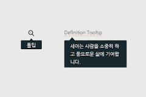

## Single Page Application(SPA)란?
**Single Page Application(단일 페이지 어플리케이션)**은 사용자가 애플리케이션을 사용하는 동안 페이지 전체를 새로고침하지 않고도 동적으로 콘텐츠를 로드하고 업데이트하는 웹 애플리케이션이다. 초기 로드 시 필요한 모든 리소스를 한 번에 불러오고, 이후 사용자 상호작용에 따라 필요한 데이터만 ~비동기적~으로 요청하여 화면을 갱신한다.
### 장점:
1. 빠른 사용자 경험: 페이지 전체를 새로고침하지 않기 때문에 사용자 상호작용이 즉각적이다
2. 부드러운 전환: 클라이언트 사이드 라우팅을 통해 페이지 간 전환이 매끄럽고 자연스러움
3. 효율적인 데이터 처리: 필요한 데이터만 **비동기적**으로 로드하여 네트워크 사용 최적화
4. 모바일 친화적: 반응형 디자인과 잘 어울려 다양한 디바이스에서 일관된 사용자 경험 제공
## 단점:
1. SEO 어려움: 검색 엔진 최적화가 전통적인 다중 페이지 애플리케이션(MPA)에 비해 복잡할 수 있다
2. 초기 로드 시간: 모든 필요한 리소스를 한 번에 로드하므로 초기 로드 시간이 길어질 수 있다.
3. 브라우저 호환성: 자바스크립트에 의존하기 때문에 자바스크립트를 비활성화한 환경에서는 동작하지 않는다.
###  SPA와 MPA의 차이점
| 특징           | SPA (Single Page Application)                      | MPA (Multi-Page Application)                     |
|----------------|----------------------------------------------------|--------------------------------------------------|
| 페이지 전환     | 클라이언트 사이드에서 동적으로 전환                  | 서버에서 전체 페이지를 새로 로드                    |
| 초기 로드       | 한 번에 모든 리소스를 로드                            | 필요할 때마다 개별 페이지를 로드                    |
| 사용자 경험     | 빠르고 부드러운 인터랙션                              | 페이지 새로고침으로 인한 다소 느린 전환               |
| SEO            | 구현이 복잡할 수 있음                                 | 자연스럽게 검색 엔진에 최적화됨                      |
| 서버 부하       | 클라이언트에 더 많은 부담                              | 서버에 각 요청 시마다 페이지를 렌더링                   |
| 개발 복잡성     | 클라이언트 사이드 로직이 복잡할 수 있음                | 서버 사이드와 클라이언트 사이드 로직이 분리됨           |
> # 비동기적(Asynchronous) 요청과 동기적(Synchronous)요청이 무슨 요청인데?
> 이 두 요청은 특히나 SPA에서 자주 사용되는 개념들이다.
> ## 동기적(Synchronous) 요청이란?
> 요청을 보낸 후 응답을 받을 때까지 다른 작업 중단하고 기다리는 방식
> 
> 즉, 요청이 완료될 때까지 다음 코드 실행을 멈춘다.
> ### 특징:
> - **블로킹(blocking)**: 요청이 완료될 때까지 프로그램의 실행이 멈춘다.
> - **순차적 실행**: 코드가 순서대로 한 줄씩 실행된다.
> ### 예시:
> ``` javascript
> // 동기적 AJAX 요청 (Javascript의 XMLHttpRequest 사용)
> fuction fetchDataSynch(){
>    const xhr = new XMLHttpRequest();
>    xhr.open('GET', 'https://api.example.com/data', false); // false는 동기 요청을 의미
>    xhr.send(null);
>    
>    if (shr.status === 200){
>       console.log('데이터: ', xhr.responseText);  
>   }else{
>       console.log('오류 발생: ', xhr.statusText);
>   }
>   
>   fetchDataSynch();
>   console.log('이 메시지는 데이터 요청이 완료된 후에 출력됩니다.');
>}
> ```
> ### 문제점:
> - **사용자 경험 저하**: 요청이 오래 걸리면 브라우저가 멈춘 것처럼 보인다
> - **비효율성**: 동시에 여러 요청을 처리하기 어렵다.
> ## 비동기적(Asynchronous) 요청이란?
> 요청을 보낸 후 응답 기다리는 거 없이, 다른 작업을 계속 진행하는 방식
> 요청이 완료되면 콜백 함수나 프로미스(promise)를 통해 응답을 처리한다.
> ### 특징:
> - **논블로킹(Non-blocking)**: 요청을 보내고 즉시 다음 작업 수행함
> - **병렬 처리**: 여러 요청을 동시에 처리할 수 있다.
> - **향상된 사용자 경험**: 요청이 오래 걸려도 브라우저가 멈춘 것처럼 보이지 않는다.
> ### 예시:
> 가장 일반적인 비동기 요청 방식은 `fetch` API나 `XMLHttpRequest`   의 비동기 모드를 사용하는 것이다. 여기서는 `fetch` API를 사용한 예시를 들어보자.
> ```JAVASCRIPT
> // 비동기적 AJAX 요청 (fetch API 사용)
> asynch function fetchDataAsync(){    
>    try{
>        const response = await fetch('https://api.example.com/data'); // 비동기 요청
>        if (!response.ok){
>            throw new Error('네트워크 오류');
>        }
>        const data = await response.json();
>        console.log('데이터: ', data);
>    }catch(error){
>        console.error('오류 발생: ', error);
>    }
>}
>
>fetchDataAsync();
>console.log('이 메시지는 데이터 요청과 동시에 출력됩니다.');
> ```
> ### 장점:
> - 향상된 성능: 여러 요청 동시에 처리
> - 부드러운 사용자 경험: 요청 중에도 브라우저가 응답 상태 유지
> - 유연성: 콜백, 프로미스, `async/await` 등 다양한 방식으로 응답 처리


# ReactDOM과 DOM Tree에 대해
## ReactDOM이란?
ReactDOM은 React 라이브러리의 일부로, React 컴포넌트를 실제 DOM(Documents Object Model)에 렌더링하고, 업데이트하는 역할을 한다. ReactDOM은 컴포넌트들을 웹 브라우저의 실제 DOM에 연결해준다.
### 주요 역할:
- **렌더링(Rendering)**: React 컴포넌트를 실제 DOM에 렌더링한다.
- **업데이트(Update)**: 상태(state)나 속성(props)이 변경될 때, 필요한 부분만 업데이트하여 효율적으로 UI 변경한다
- **퍼포먼스 최적화**: Virtual DOM을 사용하여 최소한의 실제 DOM 업데이트로 효율성을 높인다.
### ReactDOM의 주요 메소드
`ReactDOM.createRoot()`
```javascript
import React from 'react';
import ReactDOM from 'react-dom/client';
import App from './App';

const container=document.getElementById('root');
const root=ReactDOM.createRoot(container);
root.render(
    <React.StrictMode>
        <App />
    </React.StrictMode>
);
```
> 참고: React 18에서는 `ReactDOM.render()` 대신 `ReactDOM.createRoot()`를 사용하는 것이 권장된다. 이는 Concurrent 모드 및 기타 새로운 기능을 활용하기 위함이다.
## 트리 구조(DOM Tree)란?
**DOM 트리(DOM Tree)는 웹 페이지의 HTML 요소들이 계층 구조로 구성된 형태다. 각 HTML 요소는 노드(node)로 표현되며, 부모-자식 관계를 통해 트리 구조를 형성한다.
- 예시: 다음과 같은 간단한 HTML을 생각해보자
```html
<!DOCTYPE html>
<html lang="ko">
    <head>
        <meta charset="UTF-8">
        <title>React App</title>
    </head>
    <body>
        <div id="root">
            <h1>안녕하세요!</h1>
            <p>React로 만든 웹 페이지이다.</p>
        </div>
    </body>
</html>
```
이 HTML은 다음과 같은 DOM 트리르 형성함:
```MARKDOWN
- html
    - head
        - meta
        - title
    - body
        - div#root
            - h1
            - p
```
## React의 Virtual DOM과 DOM 트리
React는 Virtual DOM을 사용하여 실제 DOM과의 효율적인 상호적용을 한다.
Virtual DOM은 실제 DOM의 경량화된 사본으로, 메모리에 존재한다. 
### Virtual DOM의 작동 방식:
1. 컴포넌트 렌더링
    - React 컴포넌트가 렌더링될 때, Virtual DOM에 새로운 트리가 생성된다.
2. 변경 감지
    - 상태(state)나 속성(props)이 변경되면, React는 새로운 Virtual DOM 트리를 생성한다.
3. 차이 비교(Diffing)
    - 새로운 Virtual DOM과 이전 Virtual DOM을 비교하여 변경된 부분을 감지한다.
4. 최소한의 실제 DOM 업데이트
    - 변경된 부분만 실제 DOM에 반영하여 퍼포먼스 최적화
```JAVASCRIPT
import React, {useState} from 'react';
import ReactDOM from 'react-dom/client';

function App(){
    const [count, setCount] = useState(0);

    return(
        <div>
            <h1>카운터: {count}</h1>
            <button onClick={() => setCount(count + 1)}>증가</button>
        </div>
    );
}
const root = ReactDOM.createRoot(document.getElementById('root'));
root.render(
    <React.StrictMode>
        <App />
    </React.StrictMode>
);
```
버튼을 클릭할 때마다 `count` 상태가 변경된다., React는 Virtual DOM에서 변경된 부분만 실제 DOM에 업데이트하여 효율적으로 UI를 갱신한다.
### 포털(Portals) 구현
ReactDOM은 포털을 사용하여 부모 DOM 트리 외부에 있는 DOM 노드에 컴포넌트를 렌더링할 수 있다. 모달, 툴팁과 같은 UI 요소를 구현할 때 유용하다.

> 툴팁: 마우스 호버했을 때 화면에 나타는 가이드 창 같은거!


```JAVASCRIPT
import React from 'react';
import ReactDOM from 'react-dom';

function Modal({ children }) {
    return ReactDOM.createPortal(
        <div className='modal'>
            {children}
        </div>,
        document.getElementById('modal-root'); //부모 DOM 트리 외부의 노드
    )
}
```